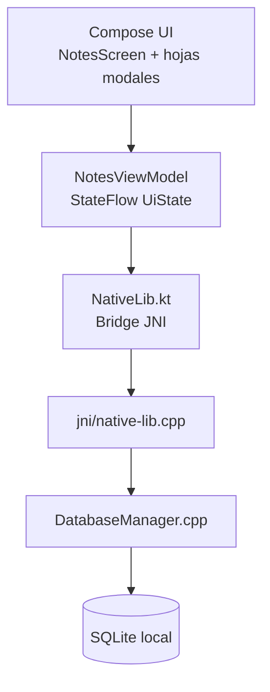
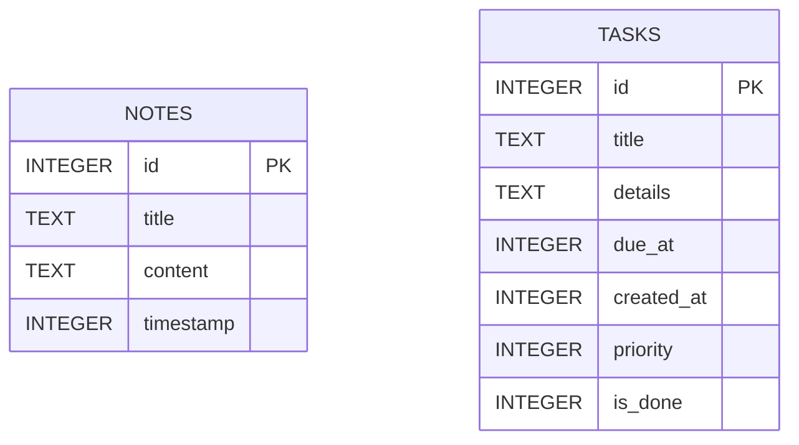

# Tien Productivity

Aplicación Android de productividad construida con **Jetpack Compose + Material 3**, con persistencia local en **SQLite nativo (C++/JNI)** y enfoque arquitectónico orientado a escalabilidad.

## Objetivo del proyecto

Tien centraliza dos capacidades clave en una única experiencia:

- **Notas**: captura rápida de información, edición y organización.
- **Agenda**: gestión de tareas con plazo, prioridad y estado de completado.

La arquitectura separa claramente UI, estado y capa de datos para facilitar evolución a módulos como proyectos, recordatorios, sincronización en nube o colaboración.

## Stack técnico

| Capa | Tecnología |
|---|---|
| UI | Jetpack Compose, Material 3 |
| Estado | ViewModel + StateFlow |
| Persistencia | SQLite (amalgamación) |
| Core de datos | C++17 (NDK) |
| Bridge | JNI |
| Build Android | AGP 8.13.2, Kotlin 2.0.21 |
| Build nativo | CMake 3.22 |

## Arquitectura (alto nivel)



## Principios arquitectónicos aplicados

1. **Single source of truth** en `NotesUiState`.
2. **Unidirectional Data Flow**: UI -> ViewModel -> NativeLib -> DB -> ViewModel -> UI.
3. **Separación de responsabilidades**:
   - UI renderiza estado y eventos.
   - ViewModel orquesta casos de uso.
   - Capa nativa ejecuta operaciones SQLite.
4. **Contratos estables** entre Kotlin y C++ mediante API JNI explícita.

## Esquema de datos



## Funcionalidades actuales

### Notas

- Crear, editar y eliminar notas.
- Búsqueda por texto.
- Orden: recientes, antiguas, alfabético.
- Recuperación de eliminación mediante acción en snackbar.

### Agenda

- Crear tareas con fecha/hora de vencimiento.
- Prioridad (baja, media, alta).
- Marcar tarea como completada.
- Eliminar tareas.
- Filtrado por día en la vista de agenda.

### UX/UI

- **Bottom Navigation Bar** para secciones principales.
- Tema global claro/oscuro con cambio en tiempo real.
- Diseño Material 3 consistente.
- Estados vacíos y feedback de error.

## Estructura del proyecto

```text
app/
  src/main/
    java/com/tien/core/
      MainActivity.kt
      NativeLib.kt
      model/
      ui/
      viewmodel/
    cpp/
      CMakeLists.txt
      jni/native-lib.cpp
      db/DatabaseManager.*
      sqlite3/
```

## Contratos principales JNI

- `createDb(path)`
- `getNotes(path)`
- `insertNote(path, title, content)`
- `updateNote(path, id, title, content)`
- `deleteNote(path, id)`
- `getTasks(path)`
- `insertTask(path, title, details, dueAt, priority)`
- `toggleTaskDone(path, id, done)`
- `deleteTask(path, id)`

## Requisitos

- JDK 17
- Android Studio reciente (con soporte AGP 8.13+)
- Android SDK instalado (compileSdk 36)
- NDK + CMake (configurados por Android Studio)

## Ejecución local

1. Clonar el repositorio.
2. Abrir el proyecto en Android Studio.
3. Sincronizar Gradle.
4. Ejecutar en emulador o dispositivo.

También puedes usar CLI:

```bash
./gradlew testDebugUnitTest
```

En Windows:

```powershell
.\gradlew.bat testDebugUnitTest
```

## Calidad y mantenibilidad

- Lógica de negocio concentrada en ViewModel.
- Operaciones de datos en capa nativa con wrappers RAII.
- Sin dependencias de red obligatorias para operar.
- Diseño listo para migrar a repositorios por feature.

## Evolución recomendada

1. Introducir capa `Repository` por dominio (`NotesRepository`, `TasksRepository`).
2. Separar la UI por features (`notes/`, `agenda/`) con navegación tipada.
3. Agregar recordatorios del sistema (`AlarmManager`/`WorkManager`).
4. Añadir pruebas de integración para JNI + DB.
5. Persistir preferencias de usuario (tema, orden, filtros) con DataStore.

## Licencia

Definir según política del proyecto (MIT, Apache-2.0, privada, etc.).
