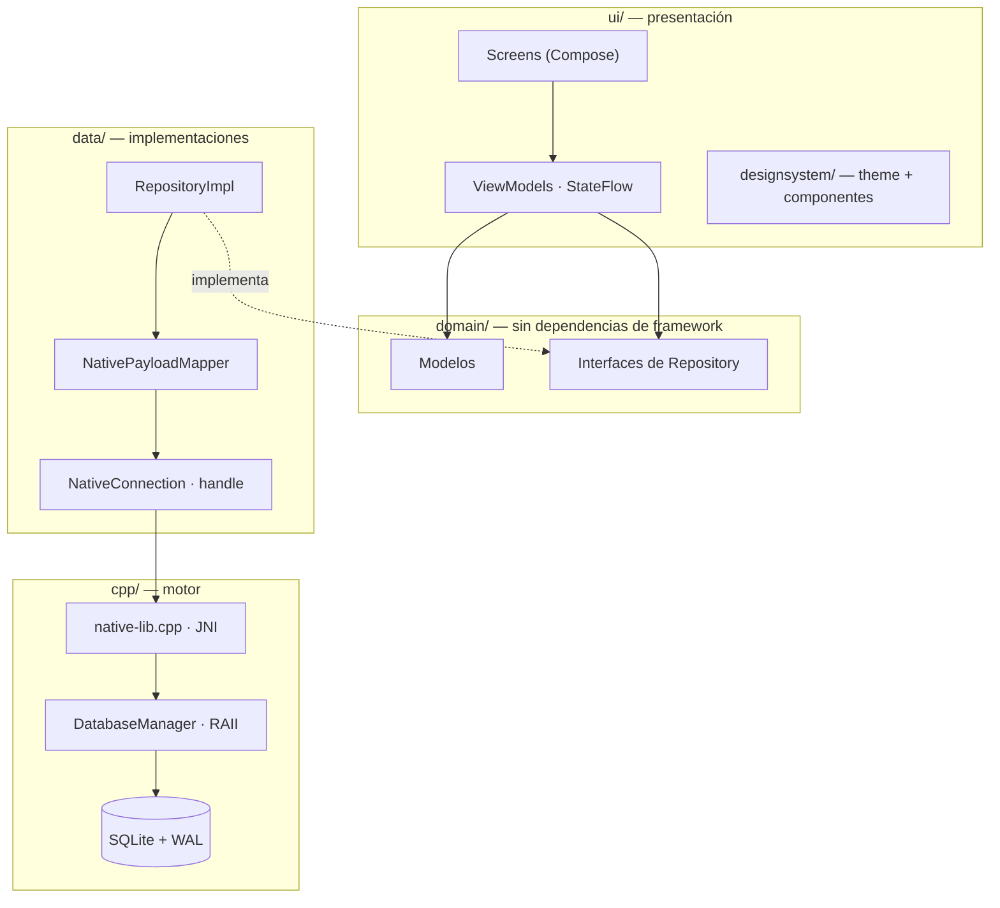
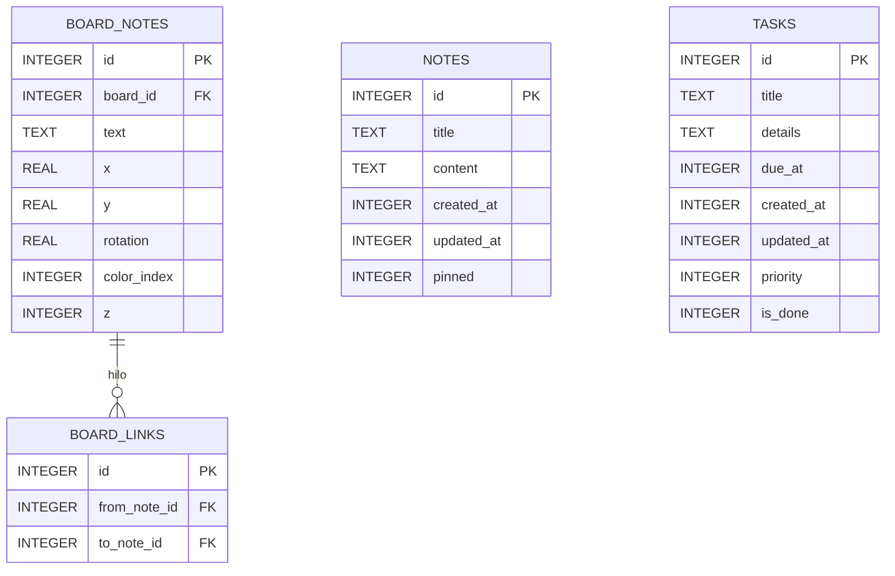

# Tien Productivity

Aplicación Android de productividad construida con **Jetpack Compose + Material 3**, con persistencia local en **SQLite nativo (C++/JNI)** y arquitectura por capas.

## Objetivo del proyecto

Tien centraliza cuatro capacidades en una única experiencia:

- **Notas**: captura rápida, edición, fijado y búsqueda.
- **Agenda**: tareas con plazo, prioridad y estado, agrupadas por día.
- **Pizarra**: una pared infinita donde clavas ideas en papeles, las mueves con
  la mano y las unes con hilo.
- **Aula virtual**: tus entregas reales de la UNSA, incluidas las que el
  calendario de Moodle no te muestra.

Cada una responde a una forma distinta de pensar: la lista sirve para
*encontrar*, la agenda para *priorizar*, la pared para *relacionar* — ver a la
vez ideas que una lista obliga a recorrer en orden — y el aula virtual para
*no perder una entrega*.

## Stack técnico

| Capa | Tecnología |
|---|---|
| UI | Jetpack Compose, Material 3, Navigation Compose |
| Estado | ViewModel + StateFlow (UDF) |
| Preferencias | DataStore |
| Persistencia | SQLite (amalgamación) con migraciones versionadas |
| Core de datos | C++17 (NDK) |
| Bridge | JNI con handle persistente |
| Build Android | AGP 8.13.2, Kotlin 2.0.21, JDK 17 |
| Build nativo | CMake 3.22 |
| Aula virtual | OkHttp + Jsoup (módulo `:dutic`) |

## Arquitectura


```mermaid
flowchart TD
    subgraph ui["ui/ — presentación"]
        A["Screens (Compose)"]
        B["ViewModels · StateFlow"]
        DS["designsystem/ — theme + componentes"]
    end
    subgraph domain["domain/ — sin dependencias de framework"]
        C["Modelos"]
        D["Interfaces de Repository"]
    end
    subgraph data["data/ — implementaciones"]
        E["RepositoryImpl"]
        F["NativePayloadMapper"]
        G["NativeConnection · handle"]
    end
    subgraph native["cpp/ — motor"]
        H["native-lib.cpp · JNI"]
        I["DatabaseManager · RAII"]
        J[("SQLite + WAL")]
    end

    A --> B --> D
    E -.implementa.-> D
    B --> C
    E --> F --> G --> H --> I --> J
```

### Regla de dependencias

```
ui     → domain, core
data   → domain, core
domain → core          (Kotlin puro: sin Android, sin JNI, sin SQLite)
core   → —
```

`domain` no conoce la existencia de SQLite ni de JNI. Cambiar la persistencia a
Room o a un backend remoto toca solo `data/`.

## Decisiones de diseño relevantes

### Conexión nativa persistente

El bridge JNI expone un **handle** (`nativeOpen` → `Long`) que vive lo que dura
el proceso. Cada operación anterior abría el archivo `.db`, negociaba WAL y
ejecutaba el `CREATE TABLE` de comprobación antes de cerrarlo — marcar una tarea
como hecha costaba tres aperturas completas.

### UTF-8 real sobre `ByteArray`

`GetStringUTFChars` / `NewStringUTF` hablan *modified UTF-8* (CESU-8), que
codifica los caracteres del plano astral —los emoji— como pares subrogados. El
contrato transporta `ByteArray` con UTF-8 estándar, así que el texto sobrevive
al viaje de ida y vuelta.

### Los errores son códigos, no resultados vacíos

Las lecturas devuelven un sobre `{"ok":…}` y las escrituras un `rowid` o un
código `DbStatus` negativo, que `data/` traduce a `AppResult.Failure`. Antes un
fallo de base de datos devolvía `"[]"` y la UI mostraba «no hay notas todavía».

### Filtrado y orden en SQL

Búsqueda, orden y filtros se resuelven en la consulta, apoyados en índices
(`idx_notes_pinned_updated`, `idx_tasks_done_due`…). Antes eran propiedades
derivadas del estado de UI, recalculadas en cada recomposición sobre la lista
completa.

### Migraciones versionadas

El esquema se versiona con `PRAGMA user_version` y las migraciones se aplican en
una única transacción. Son **append-only**: nunca se edita una migración ya
publicada.

### La pizarra: por qué se siente física

El objetivo no era una superficie con tarjetas, sino que el estudiante sienta que
está clavando papeles en una pared. Los detalles que lo consiguen:

| Detalle | Por qué |
|---|---|
| **La inclinación se persiste** | Un papel que se re-inclina en cada redibujado es inconfundiblemente digital. Se sortea al clavarlo y se guarda en la BD: queda torcido como lo dejaste |
| **Se levanta antes de moverse** | Al agarrarlo crece un poco, se *endereza* hacia la horizontal (uno cuadra la hoja al cogerla) y su sombra se agranda. La sombra es lo que vende la altura |
| **Se asienta al soltarse** | La inclinación sobrepasa y vuelve con un muelle, como una hoja meciéndose sobre su chincheta |
| **Tiene grosor** | Una franja más oscura en el borde inferior y un brillo especular en la chincheta convierten un rectángulo en un objeto |
| **El hilo cuelga** | Una recta entre dos notas es la arista de un grafo. Una curva con caída es cuerda con peso. Y proyecta sombra sobre el corcho |
| **Háptica** | Vibra al levantar el papel y al soltarlo, en momentos que el usuario ha causado |
| **Se levanta al frente** | Cogerlo lo sube en el orden de apilado, como al sacar una hoja de un montón |
| **La pared se mueve** | El corcho se desplaza con la cámara. Si se quedara quieto sería una lista con imagen de fondo |

**Gestos** — deliberadamente los de una mano frente a un tablón real:

| Gesto | Acción |
|---|---|
| Arrastrar en cualquier sitio | Recorrer la pared |
| Pellizcar | Acercarse o alejarse |
| **Mantener pulsado** y arrastrar | Coger un papel y moverlo |
| Tocar un papel | Seleccionarlo |
| Tocar dos veces la pared | Clavar un papel ahí |

Coger algo es una decisión, así que exige una pulsación deliberada. Como el
arrastre simple *no* lo consume el papel, ese gesto cae hasta la pared y
desplaza la vista — por eso sigue funcionando aunque el dedo caiga sobre una nota.

### Rendimiento de la pizarra

Tres decisiones sostienen la fluidez con muchos papeles:

1. **Una sola capa GPU.** Desplazar y hacer zoom es una transformación sobre un
   único `graphicsLayer`, no un *relayout* de cada papel.
2. **Lambdas, no valores.** `offset { }` y `graphicsLayer { }` difieren la
   lectura a las fases de *layout* y *draw*. Con la forma de valor, cada frame de
   cada arrastre recompondría el composable entero.
3. **Culling con `derivedStateOf`.** El filtro se re-ejecuta con la cámara, pero
   solo recompone cuando el *resultado* cambia — es decir, cuando un papel entra
   o sale de pantalla.

El arrastre nunca pasa por el ViewModel: la posición viva es estado local del
composable, y solo el punto de reposo llega a la base de datos.

### El aula virtual: por qué existe el módulo `:dutic`

El calendario de Moodle devuelve solo eventos **accionables** — futuros y sin
entregar. Una tarea ya vencida, o sin fecha, **desaparece de la vista**. Así se
pierden entregas.

`:dutic` es un módulo Gradle propio (no un paquete dentro de `:app`), portado
desde el MCP/CLI `dutic`. El límite lo hace cumplir el compilador: todo su
interior es `internal` y lo único que `:app` puede tocar es la fachada
`DuticClient`.

| MCP (Node) | `:dutic` (Android) |
|---|---|
| Playwright + SSO de Google | WebView que captura la cookie y el `sesskey` |
| undici + `rejectUnauthorized:false` | OkHttp con TLS normal + config acotada al host |
| cheerio | Jsoup |
| 24 tools de `mcp/server.ts` | `DuticToolCatalog` + `DuticClient` |

**19 de los 24 tools portados.** Los 5 restantes están declarados en el catálogo
con estado `PENDING` en vez de omitidos, para que el hueco sea visible.

#### Dónde vive cada tool en la UI

El error a evitar era una pantalla con diecinueve botones: un *command palette*
disfrazado de interfaz, que obliga al estudiante a saber qué herramienta responde
su pregunta antes de poder hacerla.

En una universidad todo cuelga del **curso** — sus tareas, sus notas, su
material, su gente. Ese es el modelo mental real, así que es también el modelo de
navegación: una pantalla de curso alcanza cuatro tools sin nombrar ninguna.

| Tool | Dónde se llega |
|---|---|
| `list_tasks` | Aula › Tareas |
| `get_course_tasks` | Curso › Tareas |
| `get_assignment_detail` | Tocar una tarea |
| `list_courses` | Aula › Cursos |
| `get_course_contents` | Curso › Material (agrupa por sección) |
| `list_course_materials` | Curso › Material |
| `list_participants` | Curso › Gente |
| `get_course_teachers` | Curso › Gente (docentes primero) |
| `find_person` | Aula › Cursos › Buscar una persona |
| `get_person_profile` | Tocar a una persona |
| `get_grades` (curso) | Curso › Notas |
| `get_grades` / `compare_grades` | Aula › Notas |
| `session_status` · `whoami` | Cabecera del aula |
| `refresh_session` | Pantalla de acceso |

Tres no tienen entrada propia, a propósito:

- **`get_course_teachers`** se resuelve filtrando la lista de participantes que
  ya se pidió. Llamarlo sería una segunda petición idéntica con otro filtro.
- **`list_course_files`** solo aporta sobre `list_course_materials` cuando hay
  descargas, y las descargas están `PENDING`.
- **`fetch_page`** es la vía de escape del módulo, no una función de usuario.

Las secciones de un curso cargan **bajo demanda**, al abrir su pestaña por
primera vez. Cargar las cuatro de golpe serían cuatro peticiones para una
pantalla donde la mayoría abre una.

Tres divergencias deliberadas respecto al CLI:

1. **No se copia `rejectUnauthorized: false`.** En un móvil eso haría
   falsificable cada petición en cualquier Wi-Fi. El *trust store* de Android es
   tan amplio como el de Chrome; si algún dispositivo necesita la CA privada,
   hay un `network_security_config.xml` **acotado a ese único host**.
2. **Sin modo `interactive`.** El CLI abre un navegador a mitad de operación; un
   móvil no puede secuestrar lo que estés haciendo. La expiración se reporta y
   la UI decide cuándo mostrar el login.
3. **La edad de la sesión nunca fuerza un refresco** — el servidor es la única
   autoridad. El CLI aprendió que caducar por tiempo provocaba re-logins con la
   sesión aún viva.

#### Diseño de la pantalla

La pantalla responde a una pregunta: *¿me falta entregar algo?* El héroe no es
«tienes 12 tareas», es la **revelación**: cuántas hay realmente frente a cuántas
te enseña el calendario. Ese contraste es la tesis del producto convertida en
dato.

Las tareas ocultas llevan **borde discontinuo**: en cualquier lenguaje visual,
discontinuo significa provisional o no oficial — que es exactamente lo que son.
No compite con el riel de urgencia, que se mantiene porque una entrega de la
universidad *es* un plazo y el sistema ya dice que cálido = plazo. El color
nunca va solo: la etiqueta «Oculta» lleva el significado en palabras.

**Carga en dos pasadas.** Resolver el estado de entrega cuesta una petición HTTP
por tarea, porque Moodle solo lo admite en la página de cada una. Así que se
carga primero la lista del calendario (una llamada, casi instantánea) y el
barrido completo va detrás, corrigiendo los números. La segunda pasada muestra
una línea de progreso sobre datos ya legibles, nunca un spinner que los tape.

### Sistema de diseño

La firma visual es el **riel de urgencia**: una barra en el borde de cada tarea
cuyo color se deriva de la proximidad del plazo, de modo que la agenda se
prioriza de un vistazo sin leer fechas. El color nunca es el único portador de
significado — una tarea vencida lleva además etiqueta y texto.

Los tonos cálidos (ocre, arcilla) están **reservados** para la urgencia; el resto
de la interfaz es fría (pino, papel). Un píxel cálido en pantalla siempre
significa «esto tiene plazo».

La pizarra es la única excepción, y es coherente: ahí el elemento cálido es la
*pared* — el corcho es marrón, y una pared no tiene plazo — mientras los papeles
quedan desaturados. En un papel el color dice qué hoja cogiste, nunca cuánto
urge, así que esa escala no toma prestado ningún tono de urgencia.

## Estructura del proyecto

```text
dutic/src/main/java/com/tien/dutic/
  core/        DuticConfig · MoodleClient · SessionStore · TtlCache
  auth/        DuticLogin (puro, testeable) · DuticAuthenticator
  domain/      model/ · repository/
  tools/       DuticToolCatalog — paridad 1:1 con el CLI
  di/          DuticContainer
  DuticClient.kt  — la única superficie pública

app/src/main/
  java/com/tien/core/
    core/            result/ · time/          — utilidades transversales
    domain/          model/ · repository/     — Kotlin puro
    data/            nativedb/ · mapper/ · repository/ · preferences/
    di/              AppContainer             — grafo de objetos
    ui/
      designsystem/  theme/ · component/
      feature/       notes/ · agenda/ · board/ · dutic/ · settings/
      navigation/
  cpp/
    core/Models.h
    db/DatabaseManager.{h,cpp} · Migrations.h
    jni/native-lib.cpp
    utils/Logger.h
    sqlite3/
```

## Esquema de datos (v3)


```mermaid
erDiagram
    BOARD_NOTES {
        INTEGER id PK
        INTEGER board_id FK
        TEXT text
        REAL x
        REAL y
        REAL rotation
        INTEGER color_index
        INTEGER z
    }
    BOARD_LINKS {
        INTEGER id PK
        INTEGER from_note_id FK
        INTEGER to_note_id FK
    }
    BOARD_NOTES ||--o{ BOARD_LINKS : "hilo"
    NOTES {
        INTEGER id PK
        TEXT title
        TEXT content
        INTEGER created_at
        INTEGER updated_at
        INTEGER pinned
    }
    TASKS {
        INTEGER id PK
        TEXT title
        TEXT details
        INTEGER due_at
        INTEGER created_at
        INTEGER updated_at
        INTEGER priority
        INTEGER is_done
    }
```

## Contrato JNI

Todas las funciones reciben el `handle` como primer argumento.

| Función | Devuelve |
|---|---|
| `nativeOpen(path)` | handle, o `0` si falla |
| `nativeClose(handle)` | — |
| `nativeInsertNote` / `nativeInsertTask` | nuevo `rowid`, o `DbStatus` negativo |
| `nativeUpdate*` / `nativeDelete*` / `nativeSet*` | filas afectadas, o `DbStatus` negativo |
| `nativeRestoreNote` / `nativeRestoreTask` | `id` restaurado (conserva identidad) |
| `nativeQueryNotes` / `nativeQueryTasks` | sobre JSON en UTF-8 |
| `nativeFindNote` / `nativeFindTask` | sobre JSON con 0 o 1 elemento |
| `nativeQueryBoardNotes` / `nativeQueryBoardLinks` | sobre JSON en UTF-8 |
| `nativeUpdateBoardNoteTransform` | filas afectadas — se llama **una vez por soltar**, nunca por frame |
| `nativeInsertBoardLink` | `id` del hilo, o `0` si ese par ya estaba unido |

## Herramientas de calidad

| Herramienta | Qué cubre | Configuración |
|---|---|---|
| **detekt** + ktlint | Análisis estático y formato de Kotlin | `config/detekt/detekt.yml` |
| **Android Lint** | Corrección, API levels, recursos, accesibilidad | bloque `lint {}` en `app/build.gradle.kts` |
| **compose-lint-checks** | Reglas propias de Compose: parámetros inestables, `Modifier` ausente, estado mal elevado | vía `lintChecks` |
| **Informes del compilador de Compose** | Verifica qué composables son *skippable* y qué parámetros son estables | `-PcomposeCompilerReports=true` |
| **Config de estabilidad de Compose** | Declara estables los tipos JDK inmutables | `compose_compiler_config.conf` |
| **LeakCanary** | Fugas de memoria en tiempo de ejecución (solo debug) | sin configuración |
| **clang-format** | Formato de C++ | `.clang-format` |
| **EditorConfig** | Formato compartido entre IDE y build | `.editorconfig` |
| **GitHub Actions** | Lint, detekt, tests, formato C++ y build en cada push | `.github/workflows/ci.yml` |
| **Dependabot** | Actualizaciones de dependencias agrupadas | `.github/dependabot.yml` |

```bash
./gradlew detekt          # análisis estático  → build/reports/detekt/
./gradlew lintDebug       # Android Lint       → build/reports/lint-results-debug.html
```

Formato de C++ (clang-format viene con el NDK):

```bash
CF=$ANDROID_HOME/ndk/27.0.12077973/toolchains/llvm/prebuilt/*/bin/clang-format
$CF -i app/src/main/cpp/{core,db,jni,utils}/*.{h,cpp}
```

### Estabilidad en Compose

```bash
./gradlew :app:compileDebugKotlin -PcomposeCompilerReports=true --rerun-tasks
# → app/build/compose-reports/app_debug-composables.txt
```

El informe dice, por cada composable, si es *skippable* y si cada parámetro es
estable. Es la única forma de **comprobar** que una anotación `@Immutable` se
sostiene, en vez de confiar en ella: un parámetro inestable hace que el
composable recomponga en cada frame sin que nada lo delate.

Estado actual: 25 composables *restartable skippable*, 0 no-skippable. Los
únicos parámetros inestables son los propios ViewModels, que es lo correcto.

> **Sin baseline de lint.** El proyecto está en cero hallazgos. Un baseline
> sirve para aplazar deuda heredada; crear uno vacío solo invita a enterrar
> hallazgos futuros dentro.

## Requisitos

- JDK 17
- Android Studio con soporte AGP 8.13+
- Android SDK (compileSdk 36)
- NDK + CMake

## Ejecución local

```bash
./gradlew assembleDebug        # APK de depuración
./gradlew :dutic:test          # tests del cliente del aula virtual
./gradlew testDebugUnitTest    # tests unitarios (JVM, sin dispositivo)
./gradlew assembleRelease      # APK optimizado con R8
```

En Windows: `.\gradlew.bat <tarea>`

> Los builds de **debug** compilan solo `arm64-v8a` y `x86_64`; release compila
> los cuatro ABIs.

## Pruebas

Los tests unitarios corren en la JVM sin dispositivo ni emulador, porque el
tiempo (`TienClock`) y la persistencia (`NoteRepository`) se inyectan como
interfaces.

## Evolución recomendada

1. Recordatorios del sistema con `AlarmManager` / `WorkManager`.
0. Clavar en la pizarra una nota existente (`board_notes.source_note_id` ya está
   en el esquema, sin UI todavía) y soportar varias pizarras (`boards` ya lo
   permite; hoy se usa una sola).
2. Separar `domain` y `data` en módulos Gradle propios (los límites de paquete ya
   lo permiten sin tocar los sitios de llamada).
3. Búsqueda de texto completo con FTS5 — ya está compilado en la amalgamación.
4. Tests instrumentados del puente JNI contra una base de datos temporal.
5. Exportación / importación de datos.

## Licencia

Definir según política del proyecto (MIT, Apache-2.0, privada, etc.).
