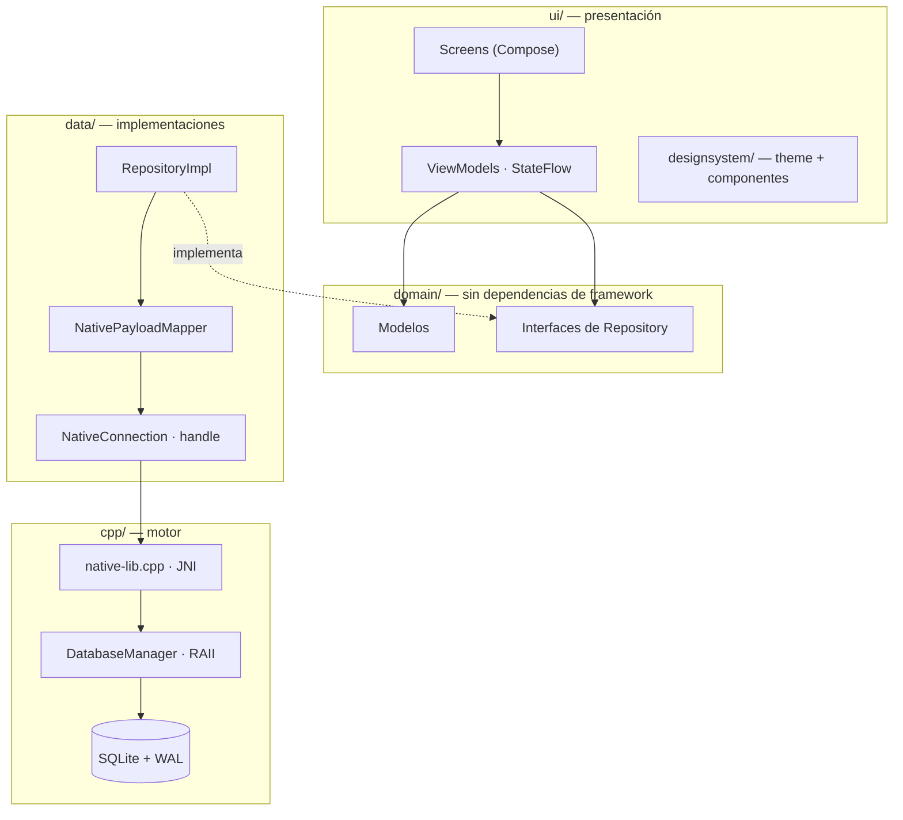
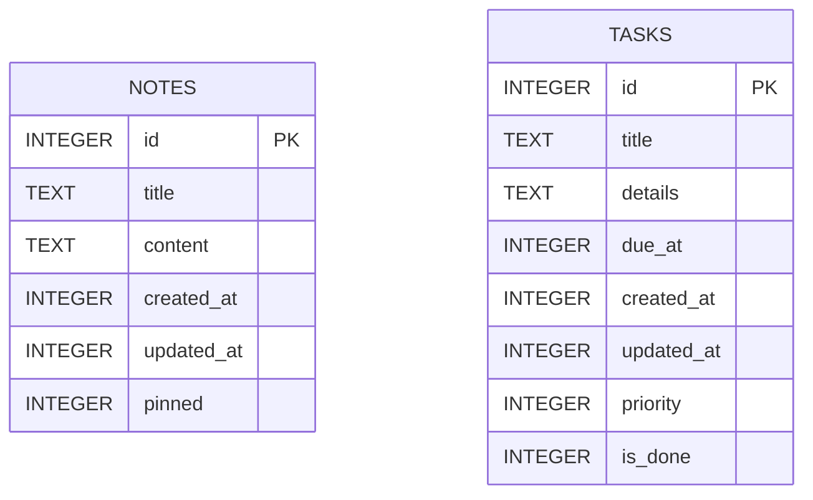

# Tien Productivity

Aplicación Android de productividad construida con **Jetpack Compose + Material 3**, con persistencia local en **SQLite nativo (C++/JNI)** y arquitectura por capas.

## Objetivo del proyecto

Tien centraliza dos capacidades en una única experiencia:

- **Notas**: captura rápida, edición, fijado y búsqueda.
- **Agenda**: tareas con plazo, prioridad y estado, agrupadas por día.

## Stack técnico

| Capa | Tecnología |
|---|---|
| UI | Jetpack Compose, Material 3, Navigation Compose |
| Estado | ViewModel + StateFlow (UDF) |
| Preferencias | DataStore |
| Persistencia | SQLite (amalgamación) con migraciones versionadas |
| Core de datos | C++17 (NDK) |
| Bridge | JNI con handle persistente |
| Build Android | AGP 8.13.2, Kotlin 2.0.21, JDK 17 |
| Build nativo | CMake 3.22 |

## Arquitectura


```mermaid
flowchart TD
    subgraph ui["ui/ — presentación"]
        A["Screens (Compose)"]
        B["ViewModels · StateFlow"]
        DS["designsystem/ — theme + componentes"]
    end
    subgraph domain["domain/ — sin dependencias de framework"]
        C["Modelos"]
        D["Interfaces de Repository"]
    end
    subgraph data["data/ — implementaciones"]
        E["RepositoryImpl"]
        F["NativePayloadMapper"]
        G["NativeConnection · handle"]
    end
    subgraph native["cpp/ — motor"]
        H["native-lib.cpp · JNI"]
        I["DatabaseManager · RAII"]
        J[("SQLite + WAL")]
    end

    A --> B --> D
    E -.implementa.-> D
    B --> C
    E --> F --> G --> H --> I --> J
```

### Regla de dependencias

```
ui     → domain, core
data   → domain, core
domain → core          (Kotlin puro: sin Android, sin JNI, sin SQLite)
core   → —
```

`domain` no conoce la existencia de SQLite ni de JNI. Cambiar la persistencia a
Room o a un backend remoto toca solo `data/`.

## Decisiones de diseño relevantes

### Conexión nativa persistente

El bridge JNI expone un **handle** (`nativeOpen` → `Long`) que vive lo que dura
el proceso. Cada operación anterior abría el archivo `.db`, negociaba WAL y
ejecutaba el `CREATE TABLE` de comprobación antes de cerrarlo — marcar una tarea
como hecha costaba tres aperturas completas.

### UTF-8 real sobre `ByteArray`

`GetStringUTFChars` / `NewStringUTF` hablan *modified UTF-8* (CESU-8), que
codifica los caracteres del plano astral —los emoji— como pares subrogados. El
contrato transporta `ByteArray` con UTF-8 estándar, así que el texto sobrevive
al viaje de ida y vuelta.

### Los errores son códigos, no resultados vacíos

Las lecturas devuelven un sobre `{"ok":…}` y las escrituras un `rowid` o un
código `DbStatus` negativo, que `data/` traduce a `AppResult.Failure`. Antes un
fallo de base de datos devolvía `"[]"` y la UI mostraba «no hay notas todavía».

### Filtrado y orden en SQL

Búsqueda, orden y filtros se resuelven en la consulta, apoyados en índices
(`idx_notes_pinned_updated`, `idx_tasks_done_due`…). Antes eran propiedades
derivadas del estado de UI, recalculadas en cada recomposición sobre la lista
completa.

### Migraciones versionadas

El esquema se versiona con `PRAGMA user_version` y las migraciones se aplican en
una única transacción. Son **append-only**: nunca se edita una migración ya
publicada.

### Sistema de diseño

La firma visual es el **riel de urgencia**: una barra en el borde de cada tarea
cuyo color se deriva de la proximidad del plazo, de modo que la agenda se
prioriza de un vistazo sin leer fechas. El color nunca es el único portador de
significado — una tarea vencida lleva además etiqueta y texto.

Los tonos cálidos (ocre, arcilla) están **reservados** para la urgencia; el resto
de la interfaz es fría (pino, papel). Un píxel cálido en pantalla siempre
significa «esto tiene plazo».

## Estructura del proyecto

```text
app/src/main/
  java/com/tien/core/
    core/            result/ · time/          — utilidades transversales
    domain/          model/ · repository/     — Kotlin puro
    data/            nativedb/ · mapper/ · repository/ · preferences/
    di/              AppContainer             — grafo de objetos
    ui/
      designsystem/  theme/ · component/
      feature/       notes/ · agenda/ · settings/
      navigation/
  cpp/
    core/Models.h
    db/DatabaseManager.{h,cpp} · Migrations.h
    jni/native-lib.cpp
    utils/Logger.h
    sqlite3/
```

## Esquema de datos (v2)


```mermaid
erDiagram
    NOTES {
        INTEGER id PK
        TEXT title
        TEXT content
        INTEGER created_at
        INTEGER updated_at
        INTEGER pinned
    }
    TASKS {
        INTEGER id PK
        TEXT title
        TEXT details
        INTEGER due_at
        INTEGER created_at
        INTEGER updated_at
        INTEGER priority
        INTEGER is_done
    }
```

## Contrato JNI

Todas las funciones reciben el `handle` como primer argumento.

| Función | Devuelve |
|---|---|
| `nativeOpen(path)` | handle, o `0` si falla |
| `nativeClose(handle)` | — |
| `nativeInsertNote` / `nativeInsertTask` | nuevo `rowid`, o `DbStatus` negativo |
| `nativeUpdate*` / `nativeDelete*` / `nativeSet*` | filas afectadas, o `DbStatus` negativo |
| `nativeRestoreNote` / `nativeRestoreTask` | `id` restaurado (conserva identidad) |
| `nativeQueryNotes` / `nativeQueryTasks` | sobre JSON en UTF-8 |
| `nativeFindNote` / `nativeFindTask` | sobre JSON con 0 o 1 elemento |

## Requisitos

- JDK 17
- Android Studio con soporte AGP 8.13+
- Android SDK (compileSdk 36)
- NDK + CMake

## Ejecución local

```bash
./gradlew assembleDebug        # APK de depuración
./gradlew testDebugUnitTest    # tests unitarios (JVM, sin dispositivo)
./gradlew assembleRelease      # APK optimizado con R8
```

En Windows: `.\gradlew.bat <tarea>`

> Los builds de **debug** compilan solo `arm64-v8a` y `x86_64`; release compila
> los cuatro ABIs.

## Pruebas

Los tests unitarios corren en la JVM sin dispositivo ni emulador, porque el
tiempo (`TienClock`) y la persistencia (`NoteRepository`) se inyectan como
interfaces.

## Evolución recomendada

1. Recordatorios del sistema con `AlarmManager` / `WorkManager`.
2. Separar `domain` y `data` en módulos Gradle propios (los límites de paquete ya
   lo permiten sin tocar los sitios de llamada).
3. Búsqueda de texto completo con FTS5 — ya está compilado en la amalgamación.
4. Tests instrumentados del puente JNI contra una base de datos temporal.
5. Exportación / importación de datos.

## Licencia

Definir según política del proyecto (MIT, Apache-2.0, privada, etc.).
